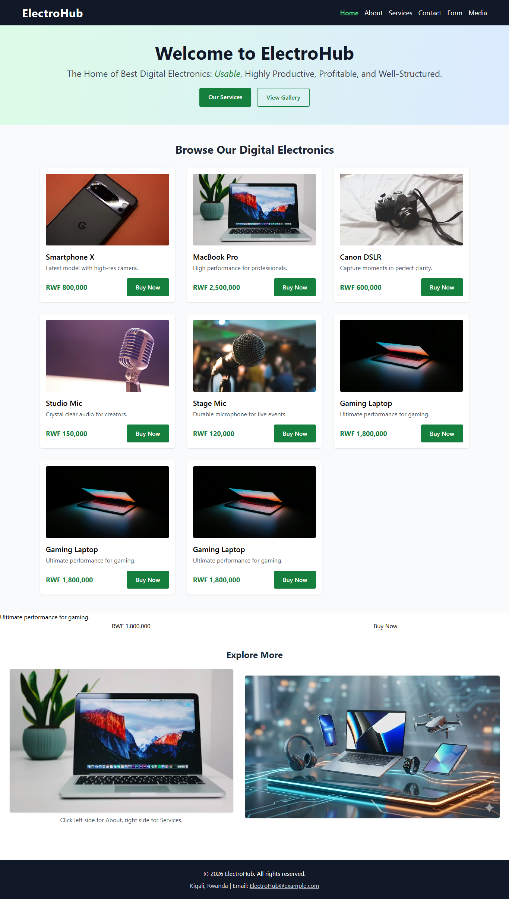
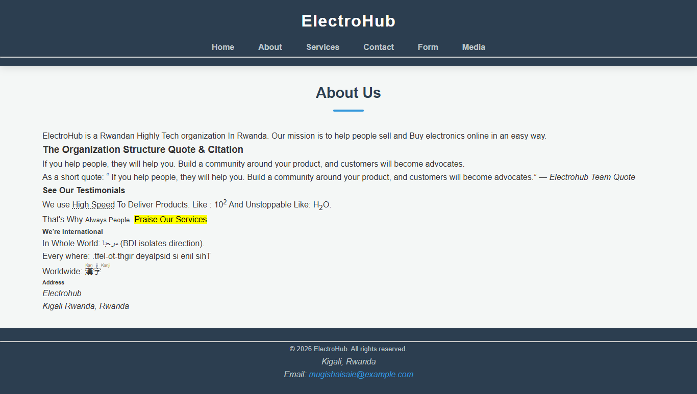
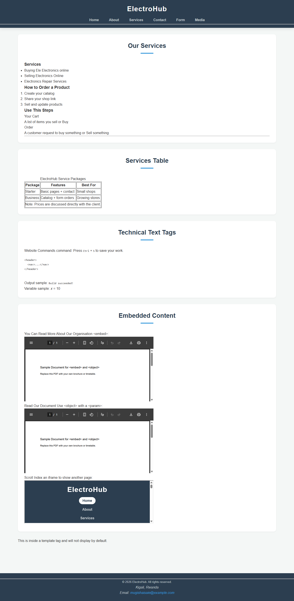
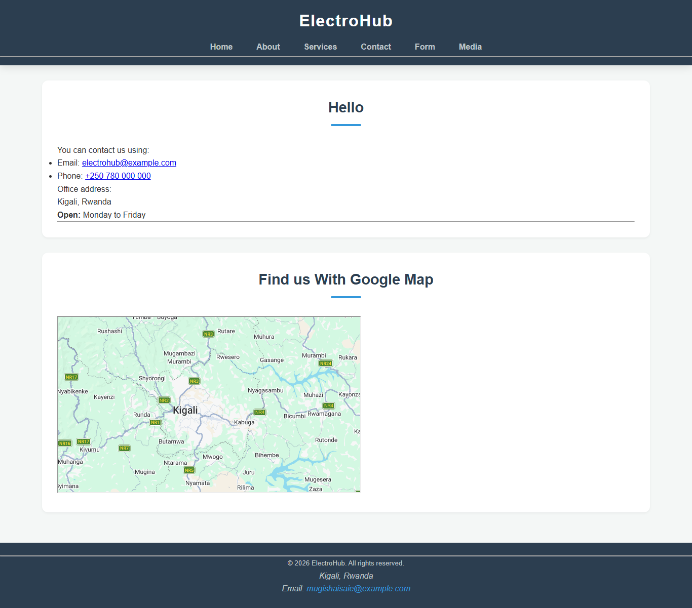
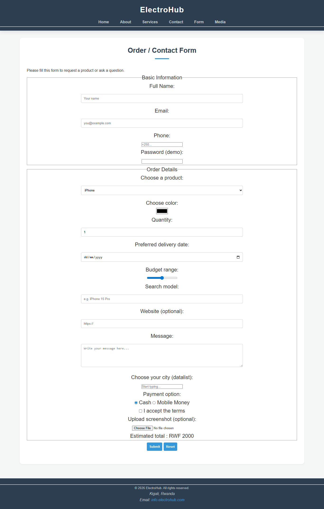
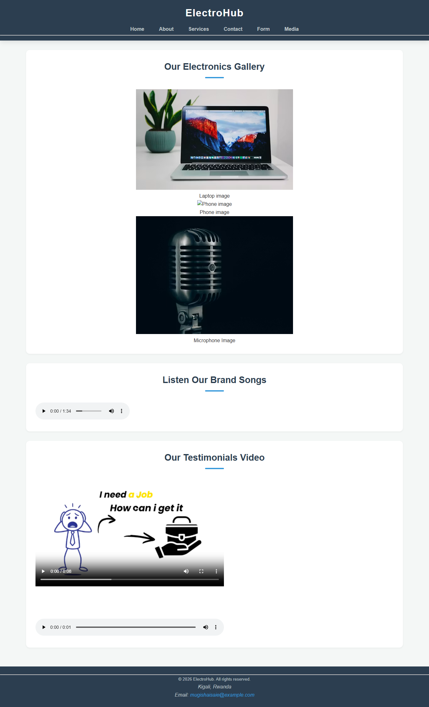

# ElectroHub

Hello Welcome to _ElectroHub\_ Website_

This is website will help you to buy or sell your desired Digital Electronics

I have asked many People about this problem where people face In Rwanda, many people want to buy electronics fast, but they struggle to:
see real prices
compare products
get clear description/specs
contact seller quickly
So they end up wasting time asking “price?” on WhatsApp for every item.
Why it matters: It slows business, customers lose trust, and sales drop.

## To get Started With Our Website

Project Title: "ElectroHub" – A Trusted Electronics Marketplace

### _Users_

Students buying phones/laptops/accessories
Parents buying TVs, speakers, home appliances
Business owners buying printers, routers, CCTV
👤 Persona Example
Name: Kevin, 22
Location: Kigali  
Goal: Buy a phone with good camera under 250k
Pain points: No clear specs, sellers hide price, too many messages 2. Persona Example
Requirement: Define target user and create 1 simple persona .
Target User: Young adults (ages 18–35) who are tech-savvy but budget-conscious.
User Persona:
Name: Alex
Role: IT Student
Pain Point: "I need a laptop for programming, but I don't have time to walk around the city comparing prices, and I'm afraid of getting scammed."
Need: A mobile app where he can filter laptops by specs (RAM, Storage) and see the exact price instantly.
he product is authentic and comes with a warranty.ca

2. User Flow
   Browse ElectroHub -> Login/Register -> Browse Home (Search)-> View Products ->View Product Details -> Order -> Success

3) Your solution concept
   System type: Web app (works well on mobile too)
   Name idea: ElectroHub
   Core Features
   Login/Register (Create account or login)
   Products List (Laptops, Cameras, Mobile Devices,...)
   Product details page (specs, images, description)
   Buy / Order system ( WhatsApp option)
4) Best simple User Flow
   Start → Home → Browse Products → View Product Details → Buy Now → Fill Order Form → Submit → Confirmation

